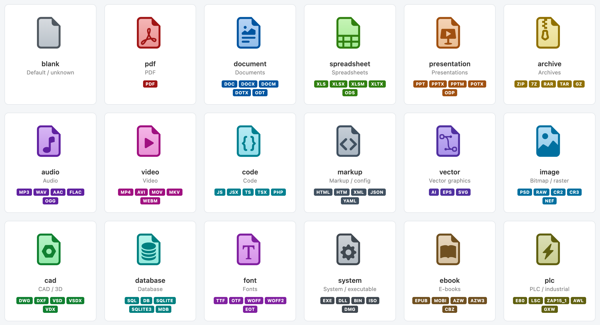

# SilverStripe Asset Icons

Replaces the default document thumbnails in SilverStripe's Asset Admin with **category-colored SVG icons** and a **CSS extension text overlay**. Handles any file extension automatically — exotic ones like `.zap15_1` just work.



## Requirements

- SilverStripe 5 (`silverstripe/asset-admin: ~2.0`)
- `restruct/silverstripe-simpler` (provides DOMNodesInserted events)

## How it works

1. **JavaScript** reads React fiber data from gallery items and sets `data-ext` attributes on the DOM
2. **SCSS** maps ~170 file extensions to 18 categories, each with a colored SVG icon
3. **CSS `::after`** overlays the actual file extension as text on every icon
4. Unknown extensions get the default gray icon with the extension text still visible

Regular images don't need icons — SilverStripe generates thumbnails for those. This module targets document-category files only.

## Categories

| Category | Color | Extensions |
|----------|-------|------------|
| **pdf** | Red | pdf |
| **document** | Blue | doc, docx, docm, dotx, odt, ott, rtf, txt, md, pages, wpd, wps |
| **spreadsheet** | Green | xls, xlsx, xlsm, xltx, ods, ots, csv, tsv, numbers |
| **presentation** | Orange | ppt, pptx, pptm, potx, odp, otp, key |
| **archive** | Gold | zip, 7z, rar, tar, gz, tgz, bz2, xz, cab, jar, war, deb, rpm |
| **audio** | Purple | mp3, wav, aac, flac, ogg, opus, m4a, wma, aiff, aif, mid, midi |
| **video** | Magenta | mp4, avi, mov, mkv, webm, flv, wmv, mpg, mpeg, m4v, 3gp, ogv, vob |
| **code** | Teal | js, jsx, ts, tsx, php, py, rb, java, c, cpp, cs, go, rs, swift, sh, bat, ... |
| **markup** | Slate | html, htm, xml, json, yaml, yml, toml, ini, cfg, css, scss, sass, less |
| **vector** | Indigo | ai, eps, svg |
| **image** | Cyan | psd, raw, cr2, cr3, nef, dng, tif, tiff, bmp, tga, xcf, indd, sketch |
| **cad** | Dark Green | dwg, dxf, vsd, vsdx, vdx, vst, skp, blend, 3ds, fbx, obj, stl, step, stp, iges |
| **database** | Dark Blue | sql, db, sqlite, sqlite3, mdb, accdb, dbf, odb |
| **font** | Dark Purple | ttf, otf, woff, woff2, eot, pfb, pfm |
| **system** | Dark Gray | exe, dll, bin, iso, dmg, app, msi, sys, apk, ipa |
| **ebook** | Brown | epub, mobi, azw, azw3, cbz, cbr, djvu |
| **plc** | Industrial | e80, lsc, zap15_1, awl, gxw, acd, s7p, ap17-20, zap18-20, scl, udt, aml, tia, ... |

## Adding extensions

Edit `client/src/styles/asset-icons.scss`:

```scss
$ext-categories: (
  // ... existing entries ...
  myext: document,    // map to existing category
);
```

Then rebuild: `npm run build`

## Adding categories

1. Create an SVG in `client/icons/` (use an existing one as template)
2. Add to `$category-icons` map in the SCSS
3. Map extensions to the new category in `$ext-categories`
4. Rebuild: `npm run build`

## Build

```bash
cd a-silverstripe-asset_icons
npm install
npm run build       # production (minified, SVGs inlined)
npm run dev         # development
```

After building, run `composer vendor-expose` to re-expose client assets.

## Dev preview

Visit `/admin/asset-icons-preview` in your browser to see all category icons side by side.

## File structure

```
client/
  icons/              # 17 category SVG source files
  src/
    js/               # Vanilla JS source (React fiber → data-ext)
    styles/           # SCSS source
  dist/
    js/               # Copied JS (served by SilverStripe)
    styles/           # Compiled CSS (SVGs inlined as data URIs)
src/
  Dev/                # IconsPreviewController
```

## TODO

- [ ] **Tile view extension badges**: Badge positioning on gallery tiles needs work — currently disabled (only shows in table view and edit form)
- [ ] **SVG compatibility**: Check if this module's SVG handling interferes with `restruct/silverstripe-svg-images` module

## Credits

- Pictograms: [Bootstrap Icons](https://icons.getbootstrap.com/) (MIT)
