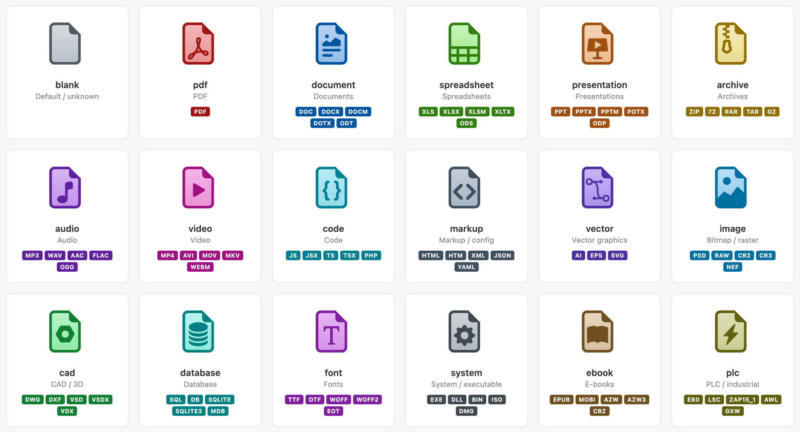

# SilverStripe Asset Icons

*Maintained by [Restruct](https://github.com/restruct). If this module saves you time, you can
[support ongoing maintenance](https://github.com/sponsors/restruct).*

Replaces the default document thumbnails in SilverStripe's Asset Admin with **category-colored SVG icons** and **rendered preview thumbnails**. Works in AssetAdmin (grid & list view, edit panel) and UploadField modals. Handles any file extension automatically.



## Requirements

- Silverstripe 5 or 6 (`silverstripe/asset-admin` `^2 || ^3`)
- PHP 8.1 or newer (Silverstripe 6 itself needs 8.3)
- `restruct/silverstripe-simpler` (provides DOMNodesInserted events): `0.x` on Silverstripe 5,
  `1.x` on Silverstripe 6
- `restruct/xpdf-static` (bundled PDF renderer, no system dependencies)

## Installation

```bash
composer require restruct/silverstripe-asset_icons
```

Then flush (`?flush=1`, or `sake dev/build flush=1` on Silverstripe 5 / `sake db:build --flush` on
Silverstripe 6). The category icons work straight away; rendered previews are opt-in (below).

> **Silverstripe 6:** this module needs `restruct/silverstripe-simpler` 1.x, which is not tagged yet.
> Until it is, Composer cannot install this module on Silverstripe 6 from Packagist alone.

## Version compatibility

`composer.json` is the source of truth; this table follows it.

| Branch | Module version | Silverstripe | PHP |
|--------|----------------|--------------|-----|
| `main` | `2.4.x` | `^5 \|\| ^6` | `^8.1` (Silverstripe 6: `^8.3`) |
| (tags only) | `2.0` - `2.3` | `^5` | `^8.1` (not declared; set by asset-admin 2) |
| (tags only) | `1.x` | `^4` | not declared; whatever Silverstripe 4 allows |

Silverstripe 4 reached end of life in April 2025 and is not supported by 2.x. `main` is the only
maintained line; a version branch is created only when a change cannot be made compatible across the
supported range.

## How it works

### Category icons

1. **CSS** immediately applies category icons using SilverStripe's built-in classes (`gallery-item--document`, `gallery-item--archive`, etc.) — **no flash of default icons**
2. **JavaScript** reads React fiber data and sets `data-ext` attributes for more specific icons (e.g., PDF instead of generic document)
3. **SCSS** maps ~170 file extensions to 18 categories, each with a colored SVG icon
4. **External SVGs** are loaded on-demand and cached by the browser (76KB CSS + ~31KB SVGs)

Regular images don't need icons — SilverStripe generates thumbnails for those. This module targets document-category files only.

### Rendered preview thumbnails

For file types that can be rendered to images (PDFs, SVGs, EPS, etc.), the module generates **actual PNG preview thumbnails** instead of showing a generic category icon. Previews appear in tile view, table view, and the edit panel.

Previews are generated on-demand the first time a file appears in Asset Admin and stored as file variants in the AssetStore. A small file-type badge (e.g. "PDF") is shown on the thumbnail so users can distinguish previews from actual images.

**How it works under the hood:**

- `RenderablePreviewExtension` (on `File`) generates PNG variants using CLI renderers (xpdf for PDFs, Ghostscript for EPS/PS/AI, rsvg-convert for SVGs)
- `RenderableThumbnailGenerator` overrides the `ThumbnailGenerator` service the asset admin reads its file list through, so the `thumbnail` field returns the preview URL for non-image files. That service is `ThumbnailGenerator.graphql` on Silverstripe 5 (asset-admin 2) and `ThumbnailGenerator.assetadminopen` on Silverstripe 6 (asset-admin 3, which has no GraphQL); the module overrides both, each keeping core's `Generates: false`
- Since React's `GalleryItem` only applies `backgroundImage` for image-category files, the JS applies the preview as an inline style for non-image files that have a `thumbnail` value

**Enable in your project config:**

```yaml
Restruct\SilverStripe\AssetIcons\Renderable\RenderablePreviewExtension:
  enable_renderable_previews: true
```

**Configuration options:**

```yaml
Restruct\SilverStripe\AssetIcons\Renderable\RenderablePreviewExtension:
  enable_renderable_previews: true
  preview_width: 800           # target width for rendered PNG
  preview_height: 800          # target height for rendered PNG
  max_renders_per_request: 5   # prevents timeouts on first load
  renderers:                   # extension => renderer class
    pdf: Restruct\SilverStripe\AssetIcons\Renderable\XpdfRenderer
    eps: Restruct\SilverStripe\AssetIcons\Renderable\GhostscriptRenderer
    svg: Restruct\SilverStripe\AssetIcons\Renderable\SvgRenderer
```

All options live on `Restruct\SilverStripe\AssetIcons\Renderable\RenderablePreviewExtension`:

| Option | Default | Effect |
|--------|---------|--------|
| `enable_renderable_previews` | `false` | Master switch. Off: no previews are generated or returned anywhere |
| `preview_width` / `preview_height` | `800` / `800` | Bounds passed to the renderer (only the SVG renderer uses them, see the note below) |
| `max_renders_per_request` | `5` | Previews generated per request; the rest render on later page loads. Existing previews are always served |
| `renderers` | pdf, eps, ps, ai, svg, svgz | Map of lower-case file extension to renderer class. Remove or override an entry per extension |

The renderers have their own config:

| Class | Option | Default |
|-------|--------|---------|
| `XpdfRenderer` | `render_dpi` | `150` |
| `GhostscriptRenderer` | `binary_path` / `render_dpi` | `gs` / `150` |
| `SvgRenderer` | `binary_path` | `rsvg-convert` |

A renderer whose binary is not found is skipped: those files keep their category icon. To remove the
extension from `File` entirely:

```yaml
SilverStripe\Assets\File:
  extensions:
    RenderablePreview: null
```

**Supported formats and their requirements:**

| Format | Renderer | Requirement |
|--------|----------|-------------|
| PDF | XpdfRenderer | Bundled via `restruct/xpdf-static` — no system deps |
| EPS, PS, AI | GhostscriptRenderer | System `gs` (Ghostscript) |
| SVG, SVGZ | SvgRenderer | System `rsvg-convert` (librsvg) |

**Using previews in templates:**

The rendered preview is available as a `DBFile` on any `File` object, supporting all standard image manipulation methods:

```html
<%-- Full-size preview as  tag --%>
$MyPDFFile.RenderedPreview

<%-- Resized preview --%>
$MyPDFFile.RenderedPreview.ScaleWidth(300)
$MyPDFFile.RenderedPreview.FitMax(400, 300)

<%-- Just the URL --%>


<%-- Conditional --%>
<% if $MyPDFFile.RenderedPreview %>
    $MyPDFFile.RenderedPreview.ScaleWidth(200)
<% end_if %>
```

Returns `null` for images (use SilverStripe's native manipulation), unsupported formats, or when previews are disabled.

From PHP, `$file->RenderedPreview()` returns the same `DBFile` (or `null`), and
`$file->getRenderedPreviewURL()` just the URL. Both generate the preview on first use.

> **Note on preview dimensions:** PDF and EPS renderers are DPI-based (default 150 DPI) and ignore the `preview_width`/`preview_height` config — the base preview is rendered at the document's native page size (e.g. ~1240×1753px for A4). The SVG renderer uses `preview_width`/`preview_height` as bounds.

**Known limitations:**

- Preview variants are stored as `.png` files (via SilverStripe's ExtRewrite variant naming), supporting full image manipulation. Upgrading from 2.2.x will regenerate previews on first access.
- Not tested with protected/draft files (the module assumes staging is removed).

## Categories

| Category | Color | Extensions |
|----------|-------|------------|
| **pdf** | Red | pdf |
| **document** | Blue | doc, docx, docm, dotx, odt, ott, rtf, txt, md, pages, wpd, wps |
| **spreadsheet** | Green | xls, xlsx, xlsm, xltx, ods, ots, csv, tsv, numbers |
| **presentation** | Orange | ppt, pptx, pptm, potx, odp, otp, key |
| **archive** | Gold | zip, 7z, rar, tar, gz, tgz, bz2, xz, cab, jar, war, deb, rpm |
| **audio** | Purple | mp3, wav, aac, flac, ogg, opus, m4a, wma, aiff, aif, mid, midi |
| **video** | Magenta | mp4, avi, mov, mkv, webm, flv, wmv, mpg, mpeg, m4v, 3gp, ogv, vob |
| **code** | Teal | js, jsx, ts, tsx, php, py, rb, java, c, cpp, cs, go, rs, swift, sh, bat, ... |
| **markup** | Slate | html, htm, xml, json, yaml, yml, toml, ini, cfg, css, scss, sass, less |
| **vector** | Indigo | ai, eps, svg |
| **image** | Cyan | psd, raw, cr2, cr3, nef, dng, tif, tiff, bmp, tga, xcf, indd, sketch |
| **cad** | Dark Green | dwg, dxf, vsd, vsdx, vdx, vst, skp, blend, 3ds, fbx, obj, stl, step, stp, iges |
| **database** | Dark Blue | sql, db, sqlite, sqlite3, mdb, accdb, dbf, odb |
| **font** | Dark Purple | ttf, otf, woff, woff2, eot, pfb, pfm |
| **system** | Dark Gray | exe, dll, bin, iso, dmg, app, msi, sys, apk, ipa |
| **ebook** | Brown | epub, mobi, azw, azw3, cbz, cbr, djvu |
| **plc** | Industrial | e80, lsc, zap15_1, awl, gxw, acd, s7p, ap17-20, zap18-20, scl, udt, aml, tia, ... |

## Adding extensions

Edit `client/src/styles/asset-icons.scss`:

```scss
$ext-categories: (
  // ... existing entries ...
  myext: document,    // map to existing category
);
```

Then rebuild: `npm run build`

## Adding categories

1. Create an SVG in `client/icons/` (use an existing one as template)
2. Add to `$category-icons` map in the SCSS
3. Map extensions to the new category in `$ext-categories`
4. Rebuild: `npm run build`

## Icon preview screen

`/admin/asset-icons-preview` (CMS access required, not in the CMS menu) shows every category icon
with sample extensions. Useful after editing icons or colours.

## Build

```bash
cd silverstripe-asset_icons
npm install
npm run build       # production build
```

After building, run `composer vendor-expose` to re-expose client assets.

## File structure

```
client/
  icons/              # 18 category SVG source files
  icons-source.svg    # Master Inkscape file with all icons
  src/
    js/               # Vanilla JS source (React fiber → data-ext + preview)
    styles/           # SCSS source
  dist/
    icons/            # External SVG files (loaded on-demand, cached)
    js/               # Copied JS
    styles/           # Compiled CSS (~77KB)
src/
  Dev/                # IconsPreviewController (visit /admin/asset-icons-preview)
  Renderable/         # Rendered preview system
    RenderablePreviewExtension.php   # File extension: generates & stores variants
    RenderableThumbnailGenerator.php # Injector override for the asset admin thumbnails (.graphql on SS5, .assetadminopen on SS6)
    RendererInterface.php            # Contract for CLI renderers
    XpdfRenderer.php                 # PDF → PNG (bundled binary)
    GhostscriptRenderer.php          # EPS/PS/AI → PNG (system gs)
    SvgRenderer.php                  # SVG → PNG (system rsvg-convert)
```

## Running the tests

The suite needs a Silverstripe project to boot. Install the module into one with a Composer path
repository and `"symlink": true` (`/tests` is `export-ignore`, so a dist install has no tests), then
run it with a manifest flush:

```bash
# Silverstripe 5 (PHPUnit 9): the test path must come BEFORE flush=1
vendor/bin/phpunit vendor/restruct/silverstripe-asset_icons/tests flush=1

# Silverstripe 6 (PHPUnit 11): flush via the environment
SS_PHPUNIT_FLUSH=1 vendor/bin/phpunit vendor/restruct/silverstripe-asset_icons/tests
```

`.github/workflows/ci.yml` builds exactly such a host project per Silverstripe major.

## Credits

- Pictograms: [Bootstrap Icons](https://icons.getbootstrap.com/) (MIT)
